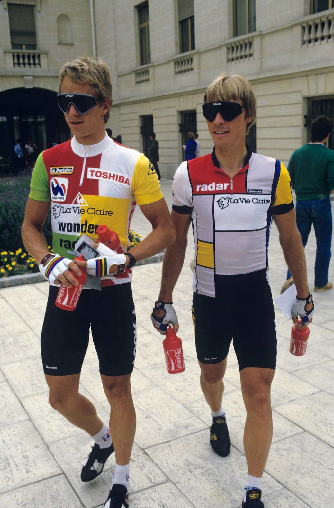

# Velo Club de VIS - Jersey Design 2022

<!---

 --->

 ---

<!---
 #### UPDATE 220809
 --->

#### ORIGINAL MESSAGE 220809

Hi James / PRIMAL - here is the artwork for the 2022 **Vélo Club de VIS** jersey design.

I am providing PDFs, which should give you the **vectors** - **please confirm that youre design folks can access the vectors!**

In most cases the PRIMAL patterns are contained within the PDFs to show how things should fit, but you will need to do some work to get this right!

I have not added a long sleeved jersey - you will need to stick the separate sleeves to the shoulders!

Please send any questions or requests to **my mobile** as I am on vacation and not checking email.

Hope this is a good start.

J.

---

### FRONT

We have a rectangular design that you'll probably recognise.

Obviously it's heavily based on this, obviously, but I have added a bit of a twist with the recursion.

The problem with the rectangle is that I want it to fit fully on all jerseys, but they are evidently different sizes.

Also, your patterns mean that the top of the design may get a bit lost in the sleeves (which touch the collar, unlike in the original where the sleeves start at the shoulders!)

The most importanrt things are that ...

 * **the red rectangle reaches the sleeve join at the top**
 * **the VéLOOK text does not go past the zipper - like the original!

You will need to figure out the scaling from that.

Also, I don't really want the blue and white rectangles at the side to be visible at all, but they may need to be for larger sizes.
These are just colours that can be used around the edges to fit in with the side colours (see later).

Try to fit the central column (grey, white, red, yellow) to fill as much of the jersey as possible.

Only rescale in ways that maintain aspect ratios and all relative text sizes and line widths.
 Thanks!

Here is a link to the file - right click to download (probably).

[velo club jersey 2022.FRONT.pdf](2022/2022exportPDF/png/velo%20club%20jersey%202022.FRONT.pdf)

### COLLAR

I have attempted to fit everything inside the red lines on the pattern but you may have to rescale or reposition a little :

Here is a link to the file - right click to download (probably), or click the image.

[velo club jersey 2022.v3.COLLAR.pdf](2022/2022exportPDF/png/velo%20club%20jersey%202022.v3.COLLAR.pdf)

### SIDE PANELS

Feel free to lose some of the stuff at the edges, but get the squares and logo to show in the red zone on the pattern (we need these to be seen on all jerseys of all sizes).

[velo club jersey 2022.SIDE.pdf](2022/2022exportPDF/png/velo%20club%20jersey%202022.FRONT.pdf)

### SLEEVES

I don't have a template for sleeves and so am guessing on sizes and dimensions here!

The designs are really for separate sleeves, but I hope you can make long sleeved jerseys by just adding these designs to the shoulder patterns!
Keep the black cuff on the upper arm of the long sleeved jerseys (just add these arem designs to the end).

Scale the cuff and text so that the text is just about readable - text covers 60% of the circumference of the arm at the wrist.
Long sleeved cuff height should be the same as the short sleeved cuff height that is at the top of the arm.

[velo club jersey 2022.ARMS.pdf](2022/2022exportPDF/png/velo%20club%20jersey%202022.ARMS.pdf)

### SLEEVE

These are for the shoulders and the tops of the long sleeved sleeves.

[velo club jersey 2022.SLEEVE.pdf](2022/2022exportPDF/png/velo%20club%20jersey%202022.SLEEVE.pdf)

The **KITWARE** logo should show at the front when riding.

The coloured bars on the cuff should be about square to the arm (on the side).

The text at top should run along the top of the shoulder!

You may need to mvoe things!

### BACK

The back looks like this!

[velo club jersey 2022.BACK.v4.pdf](2022/2022exportPDF/png/velo%20club%20jersey%202022.BACK.v4.pdf)

I want the two patterns to be as big as possible - it's OK if we lose a bit on the smallest jersey sizes, so I have fitted them to the black size line (medium?).

I hope that the top of the pattern on the pocket can be below the seam stitching.

The three pieces of coloured text need to be above the pocket.

---

Jason **DYKES**
 09/08/22
