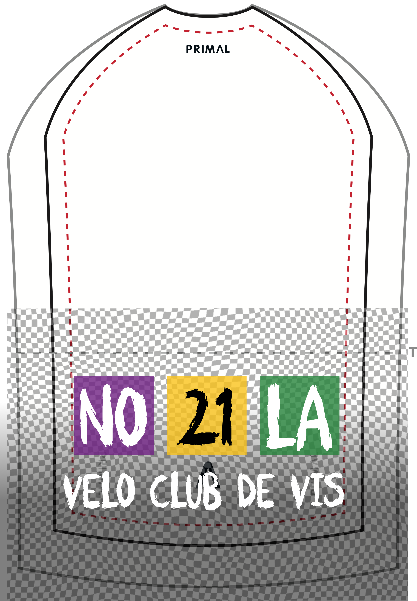

# Velo Club de VIS - Jersey Design 2022

<!---

 --->

 ---

<!---
 #### UPDATE 220809
 --->

#### ORIGINAL MESSAGE 220809

Hi James / PRIMAL - here is the artwork for the 2022 **Vélo Club de VIS** jersey design.

I am providing PDFs, which should give you the **vectors** - **please confirm that youre design folks can access the vectors!**

In most cases the PRIMAL patterns are contained within the PDFs to show how things should fit, but you will need to do some work to get this right!

I have not added a long sleeved jersey - you will need to stick the separate sleeves to the shoulders!

Please send any questions or requests to **my mobile** as I am on vacation and not checking email.

Hope this is a good start.

J.

---

### COLLAR

I have attempted to fit everything inside the red lines on the pattern but you may have to rescale or reposition a little :

Here is the file - right click to download (probably)

[velo club jersey 2022.v3.COLLAR.pdf](2022/2022exportPDF/png/velo club jersey 2022.v3.COLLAR.pdf)

### SIDE PANELS

#### Left!

So this is the _cyclists'_ left!
So when in tuck the words will be readable.

Feel free to lose some of the stuff at the edges, but get the squares and logo to show in the red zone on the pattern (we need these to be seen on all jerseys of all sizes).

[visLogo.2021.SIDE.LEFT.v1.png](PRIMALdesigns/visLogo.2021.SIDE.LEFT.v1.png)

#### Right!

So this is the _cyclists'_ right!
So when in tuck the words will be readable.

Feel free to lose some of the stuff at the edges, but get the squares and logo to show in the red zone on the pattern (we need these to be seen on all jerseys of all sizes).

[visLogo.2021.SIDE.RIGHT.v1.png](PRIMALdesigns/visLogo.2021.SIDE.RIGHT.v1.png)

### SLEEVES

I want the designs on each sleeve to be the opposite one to the one on the side!

Feel free to lose some of the stuff at the edges, but get the squares and logo to show in the red zone on the pattern and on one side of the sleeve.

Ideally I would like the logo and squares of text to be below the elbow. I worry that my designs have the text too big, so I have also added separate backgrounds and text that you can add together.

**IMPORTANT** - I used 80% opacity so that you can see the warped grid through the text blocks. Please do the same!

I don't have a template for sleeves and so am guessing on sizes and dimensions here!

The designs are really for separate sleeves, but I hope you can make long sleeved jerseys by just adding these designs to the shoulder patterns!

#### Left!

This is the _cyclist's_ left sleeve.
Lettering should be on the forearm.

[visLogo.2021.SLEEVE.LEFT.v1.png](PRIMALdesigns/visLogo.2021.SLEEVE.LEFT.v1.png)

##### Separate Background

[visLogo.2021.SLEEVE.LEFT.nologo.png](PRIMALdesigns/visLogo.2021.SLEEVE.LEFT.nologo.png)

##### Separate Logo Lettering

This may need to be added to the above background to make it small enough to fit below the elbow.

[visLogo.2021.SLEEVE.LEFT.logo.png](PRIMALdesigns/visLogo.2021.SLEEVE.LEFT.logo.png)

#### Right!

This is the _cyclist's_ right sleeve.
Lettering should be on the forearm.

[visLogo.2021.SLEEVE.RIGHT.v1.png](PRIMALdesigns/visLogo.2021.SLEEVE.RIGHT.v1.png)

##### Separate Background

[visLogo.2021.SLEEVE.RIGHT.nologo.png](PRIMALdesigns/visLogo.2021.SLEEVE.RIGHT.nologo.png)

##### Separate Logo Lettering

This may need to be added to the above background to make it small enough to fit below the elbow.

[visLogo.2021.SLEEVE.RIGHT.logo.png](PRIMALdesigns/visLogo.2021.SLEEVE.RIGHT.logo.png)

### SHOULDERS

I think these are both the same.

[vis2021.shoulder.VIS.png](PRIMALdesigns/vis2021.shoulder.VIS.png)

Can you align the graphic so that it looks like this - with the logo / word central and _just above the stitching of the cuff_?

Here is the right sleeve with the background removed to show how things should be lined up.

### BACK

The back looks like this!

[vis2021.back.VIS.png ](PRIMALdesigns/vis2021.back.VIS.png)

It should be mostly within the red lines on the pattern, but **BIG** like this:

And then,  I also want the pockets to have a different design on them. In fact I want this design to go just above the pockets, as shown here with this slightly transparent version to show positioning.

I hope that each square can go on a different pocket and the stitching will go between the squares.

Here's the pocket / above pocket artwork:

[visLogo.2021.POCKETS.VIS.png](PRIMALdesigns/visLogo.2021.POCKETS.VIS.png)

_I can send vector art for this bit if this would make things easier_.

The final thing should be positioned like this.
 Notice that the grid starts exactly half way through a line of big circles! _That's important!_

Here's a full mock up in case this is easier to fit:

[visLogo.2021.BACK.VIS.png](PRIMALdesigns/visLogo.2021.BACK.VIS.png)

### FRONT

OK - here's the front!

[visLogo.2021.FRONT.VIS.png](PRIMALdesigns/visLogo.2021.FRONT.VIS.png)

And here's how it should fit with your template.

The **V** of Velo and the **21** need to be just about within the red lines on the pattern as these must be on all the jerseys.

---

Jason **DYKES**
 09/08/22
