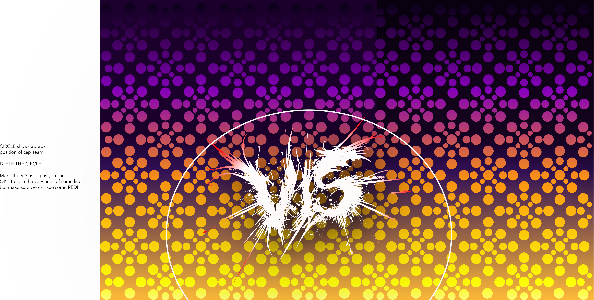
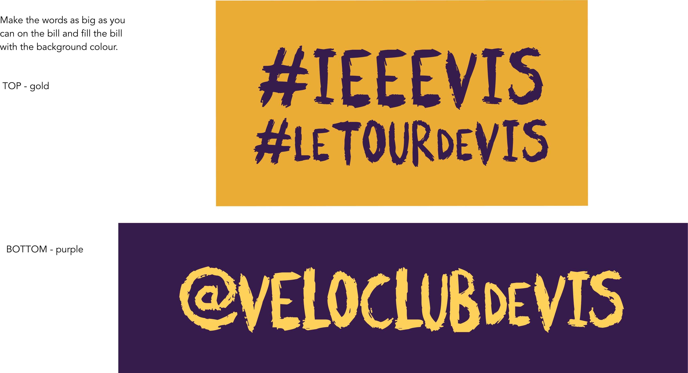
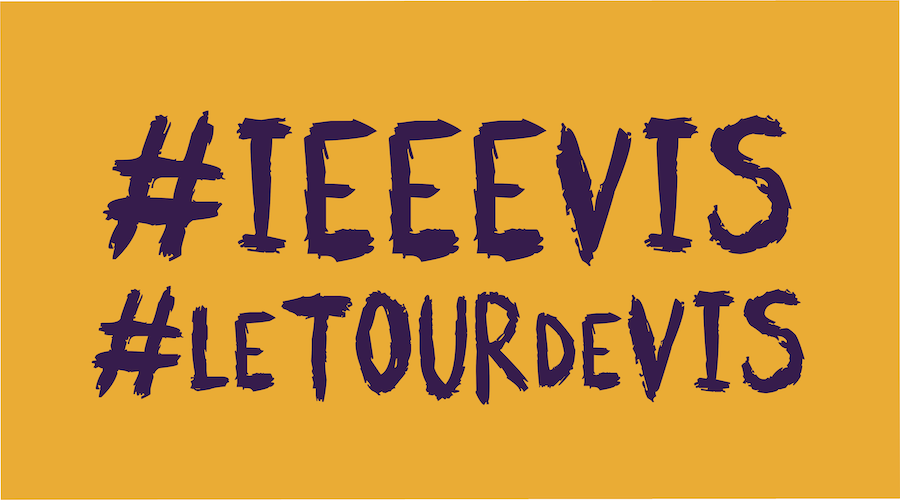
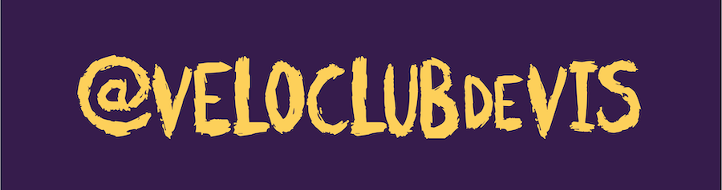

# Velo Club de VIS - Cap Design 2021 - **UPDATE #5 210829**

---

### CAP

I still wonder whether we can we make quick changes to the cap before we get them printed?

It should be quick!

I want to remove any mention of 2021 so that I can try to sell them next year if we don't get enough sales.

This would reassure me!

---

##### SIDES

[vis2021.CAP.sides.v1.png](PRIMALdesigns/vis2021.CAP.sides.v1.72.png)

Make the VIS logo as big as you can.
It's OK to lose some of the tips of the spikes at the bottom, but make sure we can see some red in the spikes!

I am guessing at the shape of the actual side of the cap here with the white line, but I'd like the seam to be about where the white line shows up (so lots of the image will not make it onto the cap).

**FULL RESOLUTON IMAGE** :
[vis2021.CAP.sides.v1.288.png](PRIMALdesigns/vis2021.CAP.sides.v1.288.png)

Here is an SVG that may help!

**FULL SVG WITH ALL DESIGNS** : [visLogo.2021.CAP.v3.svg](PRIMALdesigns/visLogo.2021.CAP.v3.svg)

You should be able to get everything out of the various layers and instructions.

---

##### MIDDLE (TOP)

The checkered pattern would look good on the top, with **Velo Club de VIS** stripes at the back and the _16 circle VIS logo_ and the darker pattern at the front.

[vis2021.CAP.middle.v1.png](PRIMALdesigns/visLogo.2021.CAP.middle.72.png)

It's hard for me to know what the dimensions are!

So this image may not fit - feel free to lose as much of the stuff at the sides as you need to as long as we get the logos and the words in.

You may need to use the SVG to do this, there is a link above.

**FULL RESOLUTON IMAGE** :
[vis2021.CAP.middle.alt.png](PRIMALdesigns/visLogo.2021.CAP.middle.288.png)

---

##### BILL

The bill can have the two _hash tags_ on top and the _twitter handle_ on the bottom - using your yellow and purple colours (nice) but this text ...

Here are the detailed designs!

[vis2021.CAP.bill.top.v2.png](PRIMALdesigns/vis2021.CAP.bill.top.v2.png)

[vis2021.CAP.bill.underside.v2.png](PRIMALdesigns/vis2021.CAP.bill.underside.v2.png)

Make the text as wide as you can please!

---

##### SVG

Like I said, here is an SVG with everything in it - see the various layers!

You should be able to get all of the imagery and vectors our of this if you need to move things around.

[visLogo.2021.CAP.v3.svg](PRIMALdesigns/visLogo.2021.CAP.v3.svg)

I hope this works - generated with [InkScape](https://inkscape.org/).

You'll see that I am using [SCRATCHIES](https://www.dafont.com/scratchies.font) font, just in case you need it.
