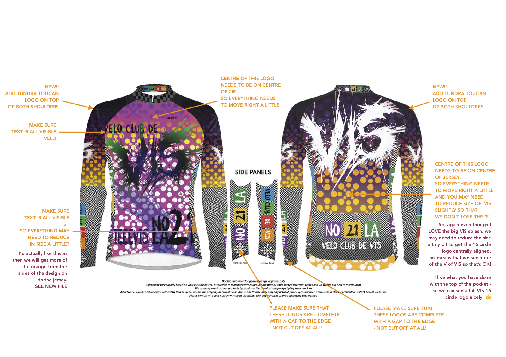
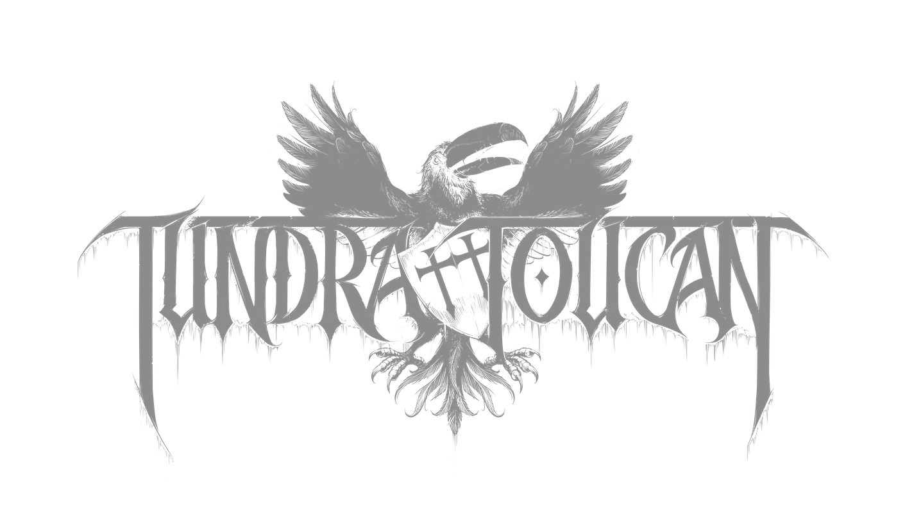
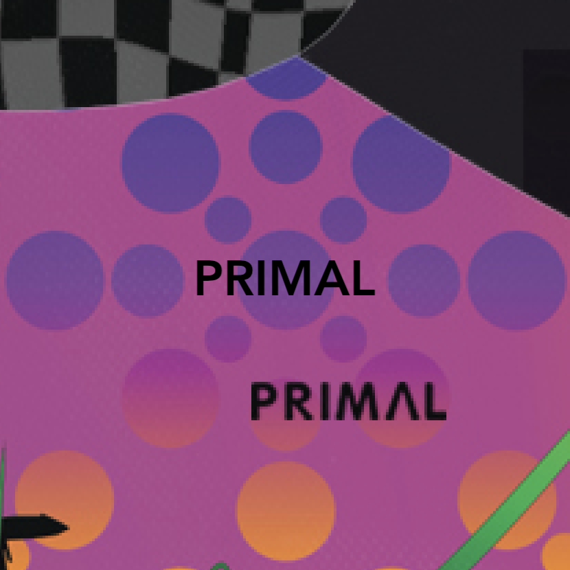

# Velo Club de VIS - Jersey Design 2021 - **UPDATE 210818**

### OVERALL

IT LOOKS **GREAT** _THANKS SO MUCH_!!

But there are of course a couple of issues.

These are annotated here - please adjust accordingly.

Click above for PNG, below for PDF ... _which may behave weirdly_!

[C20343A_19_M_R_LS_MU.jpg.pdf](PRIMALdesigns/C20343A_19_M_R_LS_MU.jpg.pdf)

### Front

Make sure that the circle design is centre aligned.

You may need to reduce the size of everything a little to achieve this, but I would still like the black text at the bottom "IEEEVIS NOLA 21" to be at the very bottom of the jersey. It looks as though the text needs to go lower, so I have redesigned this and sent an update below.

[visLogo.2021.gradient.FRONT.v6.png](PRIMALdesigns/visLogo.2021.gradient.FRONT.v6.png)

If you make this a little smaller than the first version we should fit all of the text on the jersey and get more of the orange and yellow at the sides in too, while keeping the black text at the bottom!

#### Without IEEEVIS NOLA21

Just in case, here is the design without that text ...

[visLogo.2021.gradient.FRONT.v6.noNO21LA.png](PRIMALdesigns/visLogo.2021.gradient.FRONT.v6.noNO21LA.png)

... and here is the text to be added!

[visLogo.2021.gradient.FRONT.v6.NO21LA.png](PRIMALdesigns/visLogo.2021.gradient.FRONT.v6.NO21LA.png)

Just make sure the text is at the bottom of the jersey, right aligned and aligned nicely with the 16 circle VIS logos!

Sorry to sound so fussy!

### Shoulders

Can you add a **new TUNDRA TOUCAN** logo to the very top of the shoulder - above VIS and just before it bends.

It needs to be quite dark and subtle.
It must be centrally aligned (horizontal and vertical) on a 16 circle VIS logo.

Here is a mock-up

[visLogo.2021.COLLAR.v1.png](PRIMALdesigns/vis2021.shoulder.VIS.v2.png)

Here is the logo.  I added it at 50% opacity and centred it on one of the VIS logos in the mock up - do try to get this alignment correct please!

[ToucanTransparentGrey.288.png](PRIMALdesigns/ToucanTransparentGrey.288.png)

### Pockets

I'd like to replace :

* <code>VELO CLUB DE VIS</code>

... with ...

* <code>@VELOCLUBDEVIS</code>

... as shown please!

I also want some **extra text** on the bottom of the pocket - looks like there is room!

[visLogo.2021.POCKETS.v2.png](PRIMALdesigns/visLogo.2021.POCKETS.v2.png)

I hope that each coloured square can go on a different pocket and the stitching will go between the squares.

Please check!

Just in case it helps, here is the background without the NOLA -

[visLogo.2021.POCKETS.v2.noNO21LA.png](PRIMALdesigns/visLogo.2021.POCKETS.v2.noNO21LA.png)

For the semi-opaque look on the the blocks I use:

* #66267F @ 80% opacity (purple)
* #F2C549 @ 80% opacity (gold)
* #448344 @ 80% opacity (green)

### PRIMAL

Can you get your **PRIMAL** logos aligned with out 16 circles logo! It looks a bit messy with it just plonked on top haphazard.

Can it go here?!

### Annotations

Everything else is noted in annotations on the **DESIGN MOCKUP** at the top of the document.

Thanks,

**AWESOME!**

Jason.

---

Jason **DYKES**
 18/08/21
