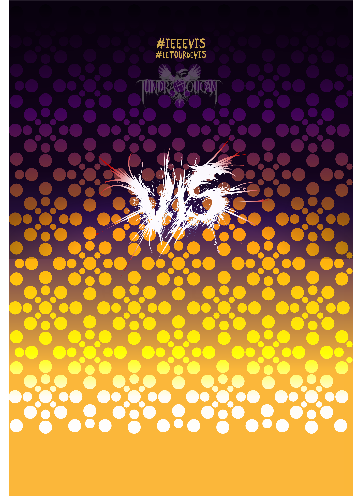

# Velo Club de VIS - Jersey Design 2021 - **UPDATE #2 210820**

### OVERALL

WOW **YOU SMASHED IT OUT OF THE PARK** _THANKS SO MUCH_!!

FINAL issues - both my fault as I gave you an undersaturated check for the pockets and forgot a hash tag.

### Shoulders

Can you move the **TUNDRA TOUCAN** logo down a little bit to just below the bend of the shoulder and add this text above it?

[visLogo.2021.shoulder.text.png](PRIMALdesigns/visLogo.2021.shoulder.text.png)

This new text should go _where TUNDRA TOUCAN is currently placed_ on the latest mockup.

The text should be centrally aligned with the TUNDRATOUCAN logo (and so the 16 circle VIS logo background) with width between the toucan wings and the TUNDRATOUCAN text-so about at the ends of the N and C as shown.

TUNDRATOUCAN must be moved down but centrally aligned (horizontal and vertical) on a 16 circle VIS logo.
Looks like you can drop it down one logo!

Here is a mock-up, with the yellow text (the new hashtags) at 80% opaque, which looks pretty good! Can you try this please?

[vis2021.shoulder.VIS.v3.png](PRIMALdesigns/vis2021.shoulder.VIS.v3.png)

### Pockets

I screwed up here and gave you a check pattern that was too feint and grey! Sorry!

I'd like to replace the feint (faint?) check with a higher contrast check :

[visLogo.2021.POCKETS.v3.png](PRIMALdesigns/visLogo.2021.POCKETS.v3.png)

I still hope that each coloured square can go on a different pocket and that the vertical pocket stitching will go between the squares.

Please check and see what you can do!!

Just in case it helps, here is the **NEW DARKER** background without the NOLA -

[visLogo.2021.POCKETS.v3.noNO21LA.png](PRIMALdesigns/visLogo.2021.POCKETS.v3.noNO21LA.png)

The NOLA blocks are here in case you need to add and position them :

[visLogo.2021.POCKETS.v3.NO21LA.png](PRIMALdesigns/visLogo.2021.POCKETS.v3.NO21LA.png)

For the semi-opaque look on the the blocks I use:

* #66267F @ 80% opacity (purple)
* #F2C549 @ 80% opacity (gold)
* #448344 @ 80% opacity (green)

If you need the text - as this is 100% opaque but the blocks are 80% - then the text shapes are here, to be added at 100% opacity :

[visLogo.2021.POCKETS.v3.NO21LA.noBLOCKS.png](PRIMALdesigns/visLogo.2021.POCKETS.v3.NO21LA.noBLOCKS.png)

Obviously **NO** and **LA** need to be white!

---

Thanks,

**VERY VERY EXTREMELY AWESOMELY AWESOME!**

Jason.

---

Jason **DYKES**
 20/08/21
