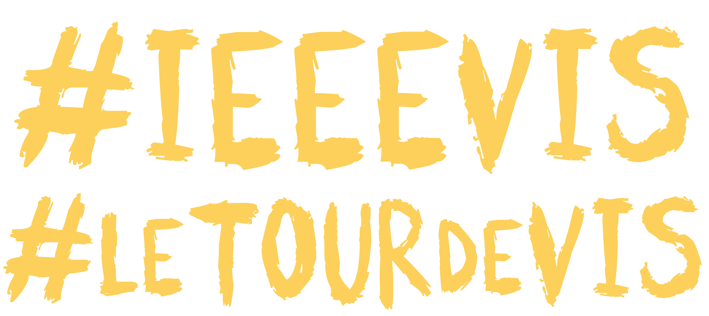
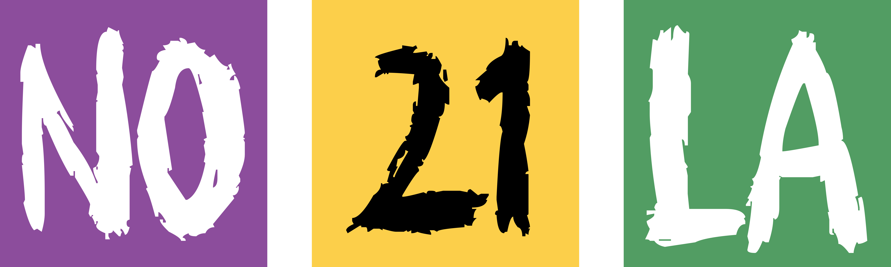

# Velo Club de VIS - Jersey Design 2021 - **UPDATE #2 210820**

### OVERALL

WOW **YOU SMASHED IT OUT OF THE PARK** _THANKS SO MUCH_!!

FINAL issues - both my fault as I gave you an undersaturated check for the pockets and forgot a hash tag.

### Shoulders

Can you move the **TUNDRA TOUCAN** logo down a little bit to just below the bend of the shoulder and add this text above it - _where TUNDRA TOUCAN is currently placed_ on the latest mockup?

[visLogo.2021.shoulder.text.png](PRIMALdesigns/visLogo.2021.shoulder.text.png)

The text should be aligned with the toucan (and so the background) with width between the toucan wings and the TUNDRATOUCAN text-so about at the ends of the N and C as shown.

TUNDRA TOUCAN must be moved down but centrally aligned (horizontal and vertical) on a 16 circle VIS logo.
Looks like you can drop it down one logo!

Here is a mock-up, with the yellow text at 80% opaque, which looks pretty good! Can you try this please?

[vis2021.shoulder.VIS.v3.png](PRIMALdesigns/vis2021.shoulder.VIS.v3.png)

### Pockets

I'd like to replace the faint check with a higher contrast check :

[visLogo.2021.POCKETS.v3.png](PRIMALdesigns/visLogo.2021.POCKETS.v3.png)

I still hope that each coloured square can go on a different pocket and that the stitching will go between the squares.

Please check and see what you can do!!

Just in case it helps, here is the **NEW DARKER** background without the NOLA -

[visLogo.2021.POCKETS.v3.noNO21LA.png](PRIMALdesigns/visLogo.2021.POCKETS.v3.noNO21LA.png)

The NOLA blocks are here :

[visLogo.2021.POCKETS.v3.NO21LA.png](PRIMALdesigns/visLogo.2021.POCKETS.v3.NO21LA.png)

For the semi-opaque look on the the blocks I use:

* #66267F @ 80% opacity (purple)
* #F2C549 @ 80% opacity (gold)
* #448344 @ 80% opacity (green)

If you need the text - as this is 100% opaque but the blocks are 80% - then the shapes are here :

[visLogo.2021.POCKETS.v3.NO21LA.noBLOCKS.png](PRIMALdesigns/visLogo.2021.POCKETS.v3.NO21LA.noBLOCKS.png)

Thanks,

**VERY VERY EXTREMELY AWESOMELY AWESOME!**

Jason.

---

Jason **DYKES**
 20/08/21
