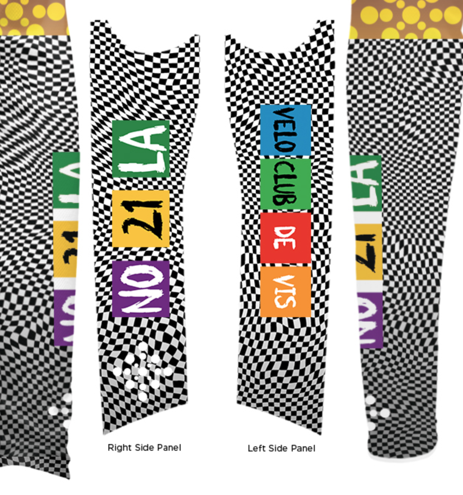
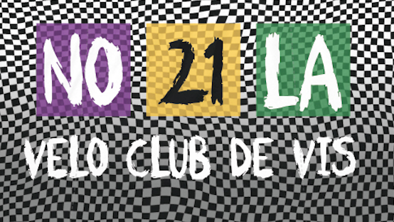
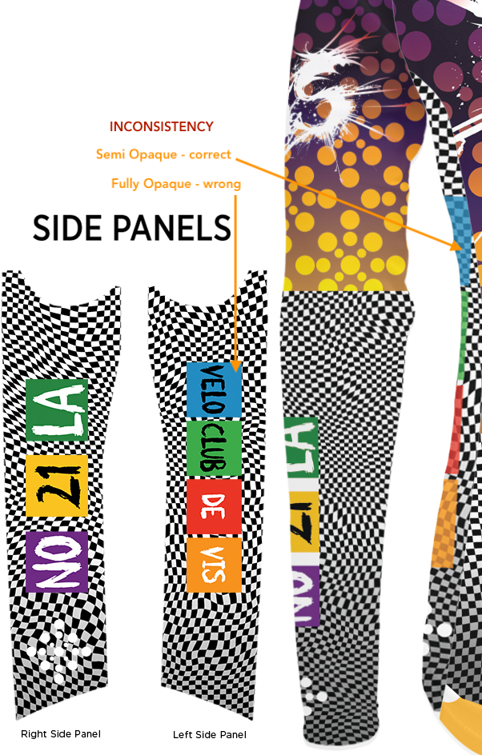
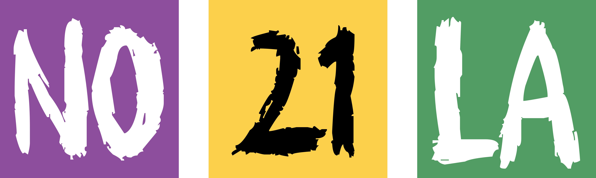
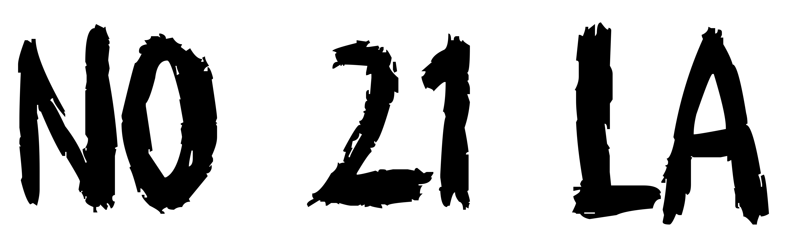
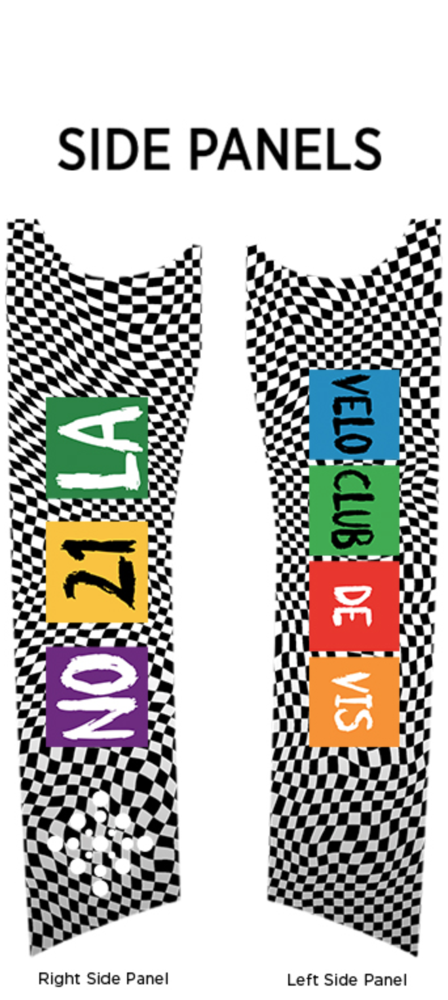
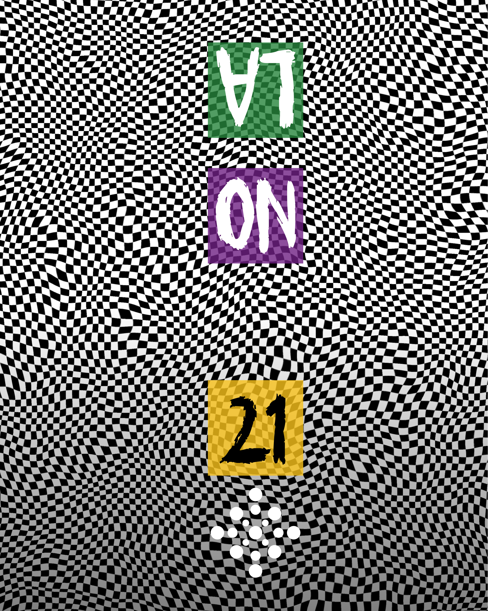
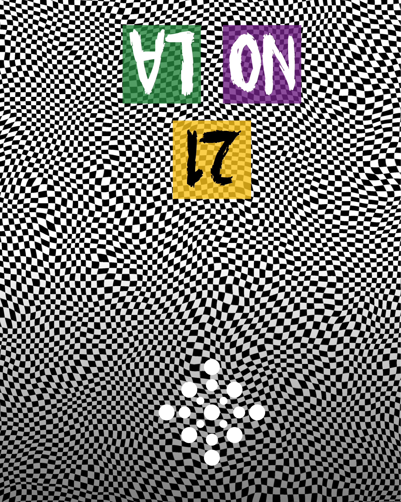
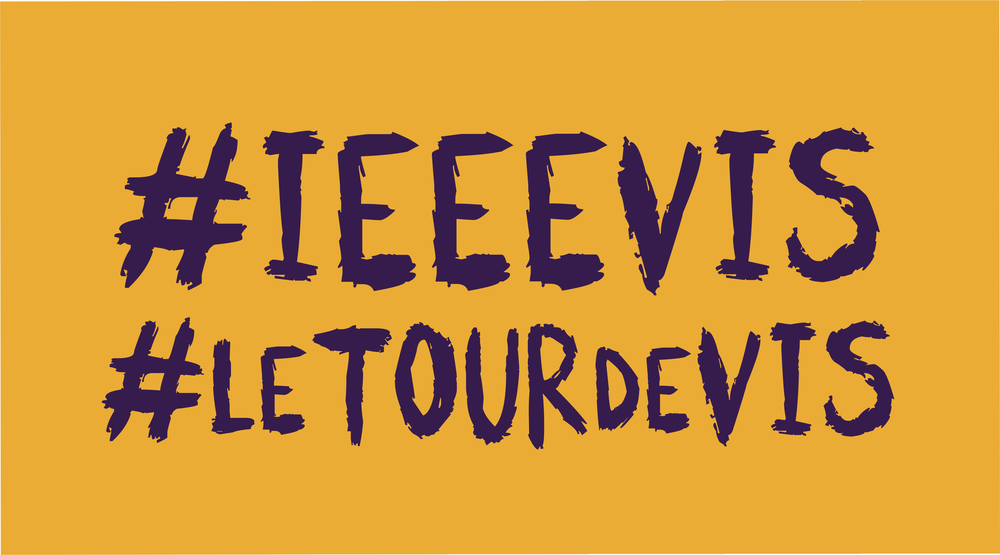
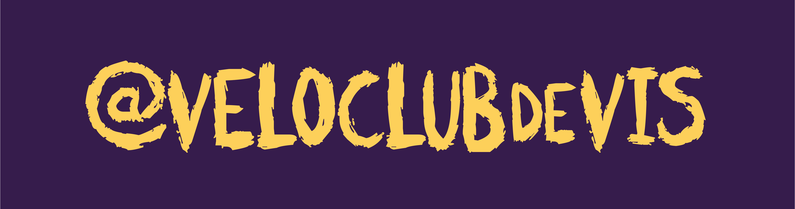

# Velo Club de VIS - Jersey Design 2021 - **UPDATE #4 210823**

<!---

[visLogo.2021.shoulder.text.png](PRIMALdesigns/visLogo.2021.shoulder.text.png)

--->

All looks great, again in many ways, BUT… there seem to be a few mistakes and these need fixing!

## ESSENTIAL CHANGES!

These are essential!

### COLOURED BLOCK LOGOS

I just noticed that the SQUARE logos on the sleeves have white spacers between them.
This is wrong - they should just have gaps like they do on the back pocket and collar.
This is how they are shown in [the original jersey design spec](https://github.com/jsndyks/veloclubdevis).

I need that fixing - nasty error.

Also, the SQUARE logos on the back pockets and sleeves are completely opaque.
I need 80% opaque colour and 100% opaque text.
See above and [the original jersey design spec](https://github.com/jsndyks/veloclubdevis) again.

_Here is the mock-up - blocks are opaque and sleeve blocks have a white line between them : **WRONG!**_

Here is how **all the blocks** should look - 80% opaque and separated by a gap and not a white space.
This is the case on :
 * jersey sleeves
 * separate sleeves
 * pockets
 * side panels
 * collar
 * everything!

In your original design the side panels and back pocket were correct - as shown in the image above.
But now they are completely opaque!
This also needs fixing please.

Actually I have just noticed that the side panels look OK on the jersey itself, but are wrong on the side panel inset.
_This inconsistency is pretty confusing_. See below.

The colours and text are provided in [update 2](https://github.com/jsndyks/veloclubdevis/blob/main/update2.md) under the **Pockets** section and should enable you to get 80% opaque coloured blocks containing 100% opaque text pretty easily.

Actually, I'll add the information here again...

The NOLA blocks are here :

[visLogo.2021.POCKETS.v3.NO21LA.png](PRIMALdesigns/visLogo.2021.POCKETS.v3.NO21LA.png)

For the semi-opaque look on the the blocks I use:

* #66267F @ 80% opacity (purple)
* #F2C549 @ 80% opacity (gold)
* #448344 @ 80% opacity (green)

You may need to create these yourselves and add the square blocks over the warped grid with 80% opacity.

The text goes on top of this and is 100% opaque.
Here is the text so that you can re-create the look.
The text is to be added at 100% opacity :

[visLogo.2021.POCKETS.v3.NO21LA.noBlocks.png](PRIMALdesigns/visLogo.2021.POCKETS.v3.NO21LA.noBlocks.png)

Obviously **NO** and **LA** need to be white as shown in all the mock-ups and examples (not black)!

---

### SHORT SLEEVED JERSEY

There are a couple of problems with this one.

You seem to have **forgotten to do the collar**?
This is just black but needs to be the same as the other jersey.

And the panels are shown as having the coloured blocks in the centre of the mockup - but not on the jersey.
**We really need coloured blocks on the jersey side panels!**

The problem with the coloured blocks is a concern here too - see above for details on how to do the **semi-opaque coloured blocks**.

---

### LONG SLEEVED JERSEY

Both side panels need to have the 16 circle VIS logo on - like the other jersey.

The mock-up shows this to be missing on the left side panel of the long sleeved jersey (see below).

---

## NON-ESSENTIAL CHANGES!

These are things to try if it's quick!!
I don't care too much, they are just ideas. for the cap.

### CAP

The cap is OK (other than the fully opaque coloured blocks).
But here is how I'd like it ... to make it **GREAT** ... just in case this is easy and you have time!

##### SIDES

[vis2021.CAP.sides.v1.png](PRIMALdesigns/vis2021.CAP.sides.v1.72.png)

Make the VIS logo as big as you can.
OK to lose some of the tips of the spikes at the bottom, but make sure we can see some red spikes!

Here is an SVG that may help!

[visLogo.2021.CAP.v1.svg](PRIMALdesigns/visLogo.2021.CAP.v1.svg)

##### MIDDLE (TOP)

The checkered pattern would look good on the top, with **21** and the _16 circle VIS logo_ and the darker pattern at the front, and **NOLA** at the back.

[vis2021.CAP.middle.v1.png](PRIMALdesigns/vis2021.CAP.middle.v1.png)

It's hard for me to know what the dimensions are!

This would be a good alternative!

[vis2021.CAP.middle.alt.png](PRIMALdesigns/vis2021.CAP.middle.alt.png)

##### BILL

The bill can have the two _hash tags_ on top and the _twitter handle_ on the bottom - using your yellow and purple colours (nice) but this text ...

[vis2021.CAP.bill.top.v2.png](PRIMALdesigns/vis2021.CAP.bill.top.v2.png)

[vis2021.CAP.bill.underside.v2.png](PRIMALdesigns/vis2021.CAP.bill.underside.v2.png)

##### SVG

Here is an SVG with everything in it - see layers!

[visLogo.2021.CAP.v2.svg](PRIMALdesigns/visLogo.2021.CAP.v2.svg)

I hope this works - generated with [InkScape](https://inkscape.org/).

You'll see that I am using [SCRATCHIES](https://www.dafont.com/scratchies.font) font.

---

Thanks,

Hope you can sort out the **ESSENTIAL CHANGES** and maybe consider the **NON ESSENTIAL CHANGES** and we can set up the shop!

Jason.

---

Jason **DYKES**
 23/08/21
